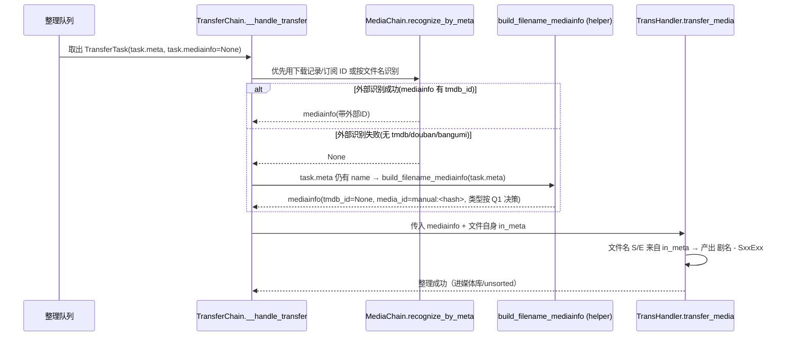

# 媒体识别与整理增强 · 架构设计与任务分解（v1）

> 撰写人：主理人（齐活林）代笔（架构师子代理环境不可用）。基于 PRD v3（`docs/media_recog_prd.md`）+ 三路只读代码勘察。
> 关联分支：`v2`（已含订阅 tmdbid 兜底回填 + 跨身份去重修复，本设计不改动订阅链路）。
> 日期：2026-07-28

## 0. 设计目标与约束

让「搜索标题 → 下载 → 整理进媒体库」链路对 TMDB/豆瓣未收录内容（短剧、自制剧等）可用：

- **C-1** 整理(transfer)识别失败时，用下载文件名解析出的 `MetaInfo` 直接构造 `MediaInfo`(tmdb_id=None) 继续整理，而非一律判失败。
- **C-2** 放开 `/download/add` 的识别强依赖，无 ID 且外部识别失败时仍允许下载（落 unsorted / 按 type）。
- **C-3** 整理命名沿用现有 `RENAME_FORMAT`，产出带 `SxxExx` 的文件（S/E 来自文件自身 `MetaInfo`，由 `transhandler` 驱动，无需 TMDB）。
- **C-4** 当文件名也无集号时，整包当电影处理（决策 Q1），绕过 `transhandler:298` 的 TV 集数硬拒。
- **C-5** 无外部 ID 内容用 `name+year` 哈希生成稳定 `media_id`，避免与已识别媒体串扰、保证去重稳定（决策 Q2）。

**硬约束**：只改仓库代码；不触碰运行容器/NAS 数据库；不新增数据库迁移（复用现有列）；测试不得做真实网络/真实 DB 调用；公开方法配中文 docstring。

## 1. 实现方案与框架选型

- 复用现有 `MetaInfo`(文件名解析) → `MediaInfo`(整理/下载用的统一媒体对象) 链路。
- 不引入新第三方依赖；仅用标准库 `hashlib`/`re` 生成稳定键。
- 新增一个**纯函数 helper** 承担「从 `MetaInfo` 构造无 ID `MediaInfo`」与「生成稳定键」两件职责，被 transfer 与 download 两处复用，避免逻辑分叉。
- 关键洞察：`transhandler` 最终文件名中的 `SxxExx` 来自**文件自身**的 `MetaInfo`(`in_meta`)，而非识别出的 `mediainfo`。因此只要让 transfer 不再因「外部识别失败」而中断，文件自带的季集信息即可正常落盘（C-3 天然满足）。

## 2. 文件列表（相对仓库根）

| 文件 | 变更类型 | 说明 |
|------|----------|------|
| `app/utils/media.py` | 修改（新增 2 个函数） | `manual_media_key` + `build_filename_mediainfo`（T0，支撑 C-5 与共用构造） |
| `app/chain/transfer.py` | 修改（插入约 1 处） | `__handle_transfer` 在识别失败后追加文件名兜底（T1，覆盖 C-1/C-4） |
| `app/api/endpoints/download.py` | 修改（调整 `add()`） | 无 ID 且识别失败时构造兜底 `mediainfo`（T2，C-2） |
| `tests/test_media_recog_transfer.py` | 新增 | transfer 兜底单测（QA/工程师） |
| `tests/test_media_recog_download.py` | 新增 | `/download/add` 兜底单测（QA/工程师） |

> 注：`app/schemas/context.py` 仅依赖 `typing` 与 `pydantic`，`app/utils/media.py` 导入 `MediaInfo`/`MediaType` 不存在循环依赖风险（已核实）。

## 3. 数据结构与接口（共用 helper）

新增于 `app/utils/media.py`（该模块当前仅依赖 `typing`，引入 `hashlib`/`re` 及 `app.schemas.context.MediaInfo`、`app.schemas.types.MediaType`）：

```python
import hashlib
import re
from app.schemas.context import MediaInfo
from app.schemas.types import MediaType


def manual_media_key(name: Optional[str], year: Optional[Union[str, int]] = None) -> str:
    """
    为无 TMDB/豆瓣等外部 ID 的“手动/文件名识别”媒体生成稳定身份键。

    键由归一化后的 ``name + year`` 取 SHA1 前 16 位构成，避免与已识别媒体串扰，
    并保证同一内容在不同次下载/整理中得到一致的去重键（决策 Q2）。
    返回形如 ``manual:<sha1_hex_16>``。
    """
    norm = re.sub(r"\s+", "", str(name or "").strip().lower())
    key = f"{norm}|{str(year or '').strip()}"
    return f"manual:{hashlib.sha1(key.encode('utf-8')).hexdigest()[:16]}"


def build_filename_mediainfo(meta, media_type: Optional[MediaType] = None) -> MediaInfo:
    """
    用下载文件名解析出的 MetaInfo 直接构造一个没有外部 ID 的 MediaInfo（tmdb_id=None）。

    用于整理/下载兜底：让 TMDB/豆瓣未收录内容（短剧等）也能走通整理与下载目录路由。

    - 类型决策（决策 Q1）：若类型为 TV/UNKNOWN 且文件名也无集号（begin_episode 为 None），
      整包当电影处理，以绕过 transhandler 对 TV 文件的集数硬拒。
    - 身份键（决策 Q2）：media_id = manual_media_key(name, year)，保证去重稳定。
    - 命名中的 S/E 由文件自身 MetaInfo 在 transhandler 阶段驱动，此处仅透传 season/episode 信息。
    """
    name = getattr(meta, "name", None) or ""
    mtype = media_type or getattr(meta, "type", None) or MediaType.UNKNOWN
    # 当电影处理：TV/UNKNOWN 且文件名无集号 → 电影
    if mtype in (MediaType.TV, MediaType.UNKNOWN) and getattr(meta, "begin_episode", None) is None:
        mtype = MediaType.MOVIE
    year = getattr(meta, "year", None)
    title_year = f"{name} ({year})" if year else name
    season = None
    begin_season = getattr(meta, "begin_season", None)
    if begin_season:
        try:
            season = int(begin_season)
        except (TypeError, ValueError):
            season = None
    return MediaInfo(
        source=None,
        scrape_source=None,
        type=mtype.value if isinstance(mtype, MediaType) else mtype,
        title=name,
        year=str(year) if year else None,
        title_year=title_year,
        season=season,
        episode_list=list(getattr(meta, "episode_list", []) or []),
        season_episode=getattr(meta, "season_episode", None),
        tmdb_id=None,
        media_id=manual_media_key(name, year),
        media_source=None,
    )
```

`MediaInfo` 关键字段（来自 `app/schemas/context.py`）：`type`(str)、`title`、`year`、`title_year`、`season`(int?)、`episode_list`(List[int])、`season_episode`(str)、`tmdb_id`(int?)、`media_id`(str)、`media_source`(str?)。构造时统一给 `tmdb_id=None`、`media_id=manual_media_key(...)`。

`MetaInfo`(`app/core/meta/...`) 可用属性（已在 `metabase.py` 核实）：`name`、`type`(MediaType)、`year`、`begin_season`、`begin_episode`、`episode_list`(property, list[int])、`season_episode`(property, str)。

## 4. 程序调用流程（时序，整理链路）



下载链路 `add()`：识别失败时同样改调 `build_filename_mediainfo(metainfo)`，随后 `DownloadChain().download_single` 经 `DirectoryHelper().get_dir(media_info, include_unsorted=True)` 落 unsorted 或按 type（tmdb_id=None 的安全路径，已核实 `download_single` 不因 tmdb_id=None 报错）。

## 5. 任务列表（有序 + 依赖 + 实现顺序）

| 任务 | 编号 | 文件 | 依赖 | 内容 | 验收 |
|------|------|------|------|------|------|
| T0 | 基础 | `app/utils/media.py` | 无 | 新增 `manual_media_key` 与 `build_filename_mediainfo`（见 §3） | 两个函数可独立单测：键稳定、TV无集→MOVIE、有集→TV、media_id 非空 |
| T1 | 核心 | `app/chain/transfer.py` | T0 | 在 `__handle_transfer` 识别失败分支（约 1746 行之后、`if not mediainfo:` 校验之前）插入：若 `not mediainfo and task.meta and task.meta.name` → `mediainfo = build_filename_mediainfo(task.meta)`。覆盖「有下载记录」与「无下载记录」两条子路径（原 1722/1739 两处 `_fallback_recognize_by_meta` 之后统一兜底）。 | 一个「文件名带 S/E」的短剧样例：识别失败 → 不再报“未识别到媒体信息”，继续整理并进库 |
| T2 | 核心 | `app/api/endpoints/download.py` | T0 | `add()` 的「无显式 ID」分支（当前 126-133）：`recognize_by_meta` 返回 None 时改调 `build_filename_mediainfo(metainfo)`，**不**返回“无法识别媒体信息”；有显式 ID 且识别失败仍保持原报错（用户意图明确，属真实错误）。 | 走 `/download/add` 下无 ID 短剧种子，不再返回“无法识别媒体信息” |
| T3 | 测试 | `tests/test_media_recog_*.py` | T1,T2 | 单测（mock `recognize_by_meta` 返回 None）：① transfer 兜底产出 mediainfo 且 type 决策正确；② transhandler 对含 S/E 文件命名正确；③ `/download/add` 兜底路径返回 success；④ `manual_media_key` 同输入同输出、不同输入不同输出。禁止真实网络/真实 DB。 | 全部用例通过，无真实网络/DB 调用 |

**实现顺序**：T0 → T1 → T2 → T3。T1 与 T2 相互独立（不同文件），可与 T0 一并提交；T3 在功能代码合入后由 QA/工程师补齐。

## 6. 依赖包列表

- 无新增第三方依赖（`hashlib`、`re` 为标准库；`MediaInfo`/`MediaType`/`MetaInfo` 均为项目内已有模块）。

## 7. 共享知识（跨文件约定）

- **唯一构造入口**：transfer 与 download 两处兜底**都**调用 `build_filename_mediainfo`，不得各自内联构造，避免去重键/类型决策不一致。
- **类型决策（Q1）**：仅在「文件名也无集号」时转 MOVIE；文件名带 `SxxExx`/第X集 → 保持 TV，S/E 由 `transhandler` 从文件 `in_meta` 取。
- **身份键（Q2）**：所有无外部 ID 的兜底媒体 `media_id = manual_media_key(name, year)`；该值会被 `transferhistory_oper.add_success` / `downloadhistory_oper.get_by_mediaid` 记录/查询，天然保证跨次去重稳定且不与 `tmdb_id` 来源冲突（`get_by_type_tmdbid` 仅按 tmdb_id 查，None 不会误命中）。
- **下游安全**：`MediaChain().supplement_tmdb_info(mediainfo, meta)`（transfer:1811 / download:926）在 `tmdb_id=None` 时应为空操作；实现后需在测试里确认其不抛异常。
- **命名（C-3）**：不改 `transhandler` 命名逻辑，S/E 全部来自文件 `in_meta`，本方案仅保证 transfer 不因识别失败中断。

## 8. 待明确事项（实现期核对）

- `MediaInfo.season` 字段类型：schema 中为 `Optional[int]`，`metabase.begin_season` 可能为 `int` 或 `str`，构造时统一 `int(...)` 并容错。
- `download_single` 在 `tmdb_id=None` 时是否真的走 `include_unsorted=True` 落 unsorted：已核实 `_resolve_media_download_dir` 调用 `get_dir(media_info, include_unsorted=True)`，`tmdb_id=None` 不会致命；实现后单测覆盖。
- 是否需要为「无 name 的 task.meta」保留原失败逻辑：是——T1 仅在 `task.meta.name` 非空时兜底，否则仍走原 `if not mediainfo` 失败分支（无法整理未知内容）。
- 边界（Q4）：CSF/媒体服务器侧对中文短剧无 TMDB 条目的匹配不在本次范围，仅保证文件/NFO 层面规范（已在 PRD C-6 记录）。
